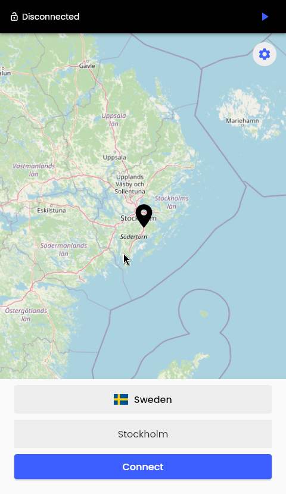
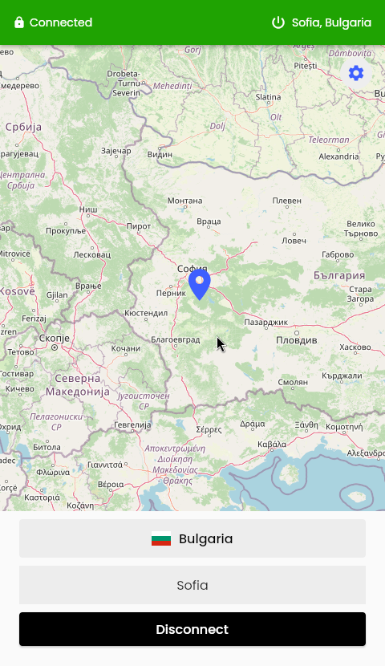
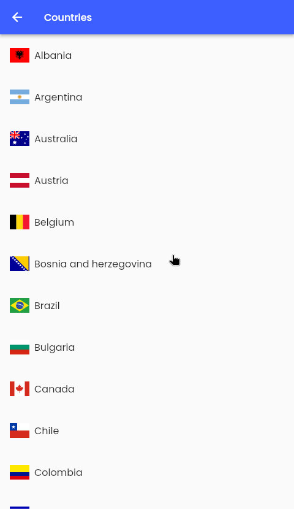
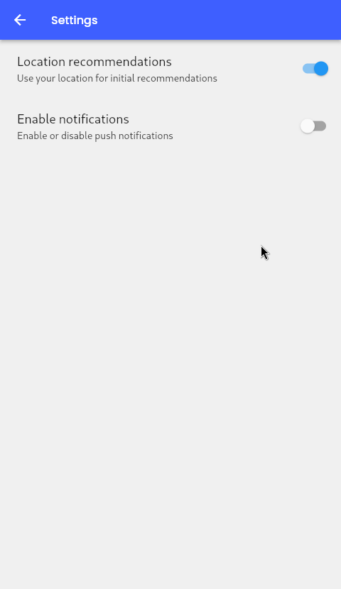

# NordVPN Flutter Client

A flutter based linux client for the [nordvpn cli](https://github.com/NordSecurity/nordvpn-linux). The project aims to be a full replacement of the nordvpn cli.

**Disclaimer**  
I am in no way, shape or form affiliated with nordvpn. This is a hobby project with the goal of gaining an understanding of the flutter framework.

## Functionality
| Features                  | Status |
|---------------------------|--------|
| Token based login         | ✓      |
| Quick Connect             | ✓      |
| Country/City Connect      | ✓      |
| NordVPN firewall settings | ✗      |
| NordVPN Meshnet           | ✗      |

## User Interface

Connected         |  Disconnected
:-------------------------:|:-------------------------:
  |  

Countries         |  Settings
:-------------------------:|:-------------------------:
  |  

## Requirements
* [NordVPN CLI](https://github.com/NordSecurity/nordvpn-linux)
* [Flutter](https://docs.flutter.dev/get-started/install)

### Running the project

Clone the repository by running 
`git clone https://github.com/sh4r10/nordvpn-client`  
or with ssh  
`git clone git@github.com:sh4r10/nordvpn-client.git`

cd into the project  
`cd nordvpn-client`  

Install the required dependencies by running  
`flutter pub get`  

For running in developer mode you can use 
`flutter run`

#### Creating a build
As the project is only supported on linux, use the command  
`flutter build linux`

This will create the following directories  
`build/linux/[arch]/release/bundle`

You may need to provide executeable permissions  
`chmod +x nordvpn_client`

The bundle directory requires everything needed to run the project, cd into it and run  
`./nordvpn_client`

## Contributions
Contributions of all kind are welcome, please create an issue if one does not already exist.  
The project uses [semantic versioning](https://semver.org/).

## License
The project is licensed under the [MIT License](LICENSE.md).
